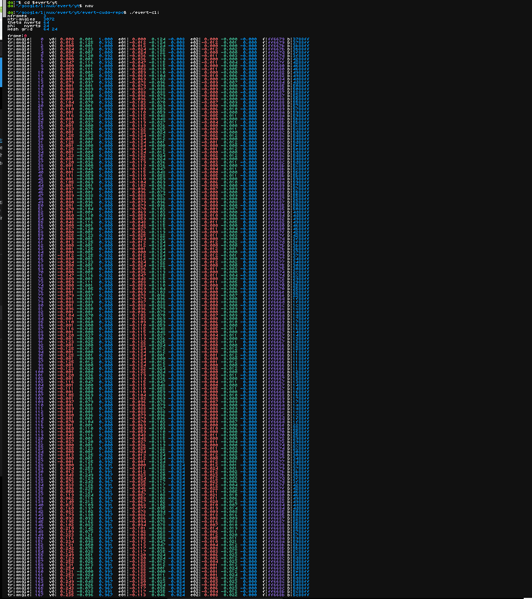

This is a CUDA port of [evert](http://www.geom.uiuc.edu/docs/outreach/oi/software.html), a C++ program that turns the sphere inside out.
Written by Nathaniel Thurston and based on ideas of William Thurston, `evert` was used for the movie [Outside In](https://www.youtube.com/watch?v=sKqt6e7EcCs).

This fork comes with a [Youtube video](https://youtu.be/MAJkn3TDMRE).

It tries to "simplify" the original implementation by keeping only first-order differential data.

`evert-cuda.cu` generates the geometry of the eversion (as an array of triangles) and renders it to a PPM image (via path tracing).

`evert-cli.cu` generates the geometry of the eversion (as an array of triangles) and prints it out to the console.

You can find out more about `evert` at the Geometry Center's [website](http://www.geom.uiuc.edu/docs/outreach/oi/).

